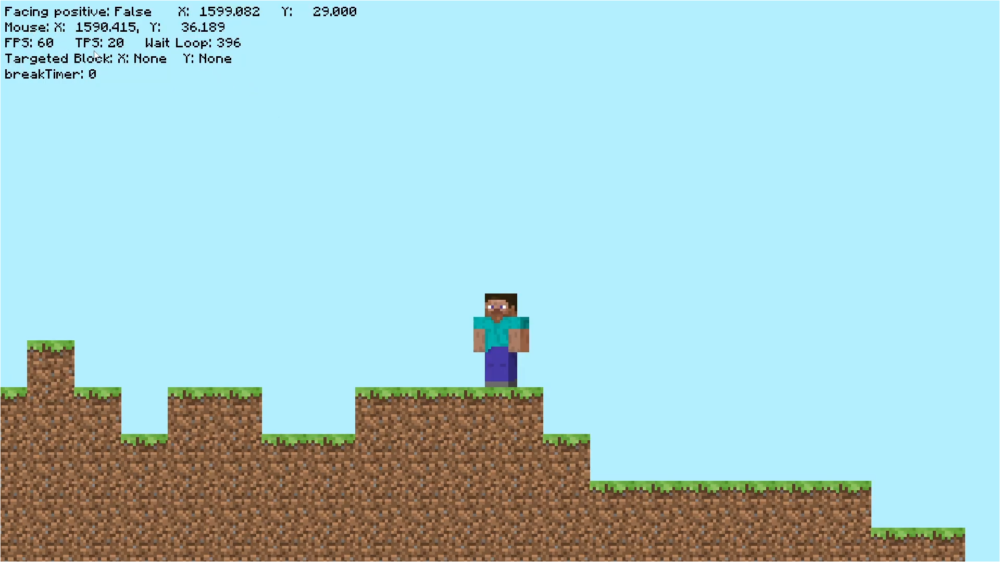

<h1 align = "center"> 🧱 Minecraft 2D 🧱 </h1>

 

This is a fan made Minecraft game, which is in a two dimentional vertical plane. The project is exclusively coded in Python  using the graphical library Pygame .

<h2 align = "center"> What does it look like? </h2>

 

<h2> Functionalities (many more are in development 😉)</h2>

- player movement through out of the 2D plane (entity physics)
- breaking blocks
- loading and unloading of 'chucks' through player presence
- nice particle effects ✨

<h2> ❗ We need help ❗ </h2>
Do you want to join the team? Here are the profiles we need:

- Python Programmer with little experience in Pygame.
- Graphic Designer, expecially experienced in Pixel Art. (we still need some entity sprites)

Feel free to contact us if you are interested in the project ! 😊 

<h2> Authors </h2>

- [@At7791](https://github.com/At7791)
- [@ShadowMaster05](https://github.com/ShadowMaster05)